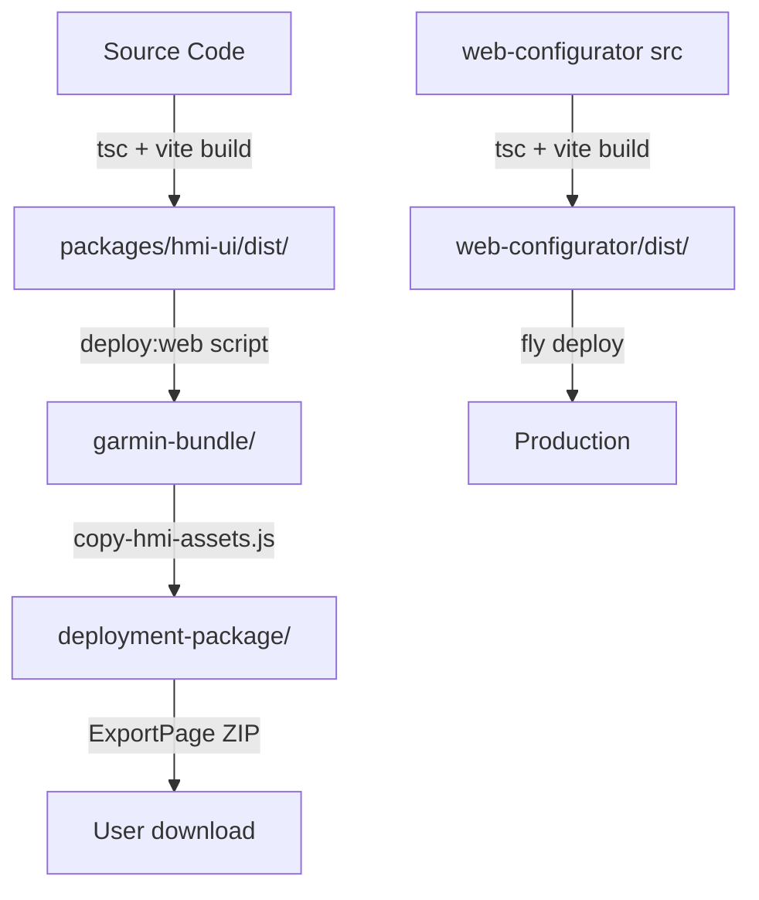

# Build Artifacts Documentation

This document explains the build artifacts in the monorepo, how they're generated, and why they should not be committed to version control.

## Overview

The monorepo generates several build artifacts during the build process. These are **auto-generated** files that should never be manually edited or committed to git.

---

## 📦 Build Artifacts

### 1. `packages/hmi-ui/dist/`

**What it is:** Production-optimized build of the HMI UI (Preact application)

**Generated by:**

```bash
pnpm --filter @gcg/hmi-ui build
```

**Build script:** Uses Vite to bundle TypeScript + Preact into optimized JavaScript/CSS

**Contents:**

- `hmi-assets/` - Bundled JS/CSS with content hashes (e.g., `index-Bs6ACjXq.js`)
- `index.html` - Entry point for HMI application
- `icons/` - SVG icon assets
- JSON config files (`dataitems.json`, `schema.json`, etc.)

**Used by:**

- Garmin devices (deployed via `deploy:web` script)
- Web configurator (copied to `deployment-package/`)

**Git status:** ✅ Already ignored via `dist/` in `.gitignore`

---

### 2. `packages/web-configurator/dist/`

**What it is:** Production build of the web-based schema configurator

**Generated by:**

```bash
pnpm --filter @gcg/web-configurator build
```

**Build process:**

1. Runs `copy-hmi-assets.js` to prepare deployment package
2. TypeScript compilation (`tsc`)
3. Vite build for production bundle

**Contents:**

- Bundled React application
- Static assets
- `index.html` entry point

**Used by:** Deployed to fly.io or served locally

**Git status:** ✅ Already ignored via `dist/` in `.gitignore`

---

### 3. `packages/web-configurator/public/deployment-package/`

**What it is:** Complete deployment package ready for export as ZIP

**Generated by:**

```bash
node packages/web-configurator/scripts/copy-hmi-assets.js
```

**Automatically runs before build:**

```bash
pnpm --filter @gcg/web-configurator build
```

**Build script:** `copy-hmi-assets.js` orchestrates the copy process

**Contents:**

```
deployment-package/
├── web/                    # HMI UI build + web assets (~4.8MB)
│   ├── hmi-assets/        # Vite build output
│   ├── icons/             # SVG icons
│   ├── images/            # PNG/SVG images
│   ├── garmin/            # Garmin config JSONs
│   └── index.html
├── configuration/          # Hardware configs + channel mappings (~500KB)
│   ├── hardware-config*.json
│   ├── channel-mapping.json
│   └── *.ebp files
├── services/              # Systemd service files (~20KB)
│   └── *.service files
└── manifest.json          # Auto-generated file listing
```

**Size:** ~5.3MB total

**Source directories:**

- `garmin-bundle/web/` → `deployment-package/web/`
- `garmin-bundle/configuration/` → `deployment-package/configuration/`
- `garmin-bundle/services/` → `deployment-package/services/`

**Purpose:** Provides all files needed for the web configurator's ZIP export feature

**Git status:** ✅ Ignored as of bloat cleanup (added to `.gitignore`)

**Why it exists:** The web configurator's Export page creates a ZIP containing this entire directory, allowing users to download a complete deployment package.

---

### 4. `packages/web-configurator/public/hmi-dist/` ⚠️

**What it is:** Legacy/outdated HMI distribution files

**Status:** ⚠️ **Should be removed or gitignored**

**Generated by:** Unclear - appears to be old build output

**Git status:** ❌ Currently tracked in git (should be ignored)

**Action needed:** Add to `.gitignore`:

```bash
echo "packages/web-configurator/public/hmi-dist/" >> .gitignore
git rm -r --cached packages/web-configurator/public/hmi-dist/
```

---

### 5. `garmin-bundle/`

**What it is:** Master deployment bundle (source for `deployment-package/`)

**Generated by:**

```bash
pnpm --filter @gcg/hmi-ui deploy:web
# Runs: ./scripts/deploy-to-web.sh
```

**Purpose:** Contains the canonical web deployment structure that gets copied to `deployment-package/`

**Git status:** ✅ Already ignored in `.gitignore`

---

## 🔄 Build Dependency Chain



**Flow:**

1. Build HMI UI: `pnpm --filter @gcg/hmi-ui build` → creates `dist/`
2. Deploy to bundle: `pnpm --filter @gcg/hmi-ui deploy:web` → creates `garmin-bundle/`
3. Build web configurator: `pnpm --filter @gcg/web-configurator build` → copies bundle to `deployment-package/` → builds `dist/`

---

## 🚫 What Should NOT Be Committed

### Already Gitignored ✅

- `dist/` - All package dist folders
- `garmin-bundle/` - Deployment bundle source
- `packages/web-configurator/public/deployment-package/` - Export package cache

### Should Be Added to .gitignore ⚠️

- `packages/web-configurator/public/hmi-dist/` - Legacy build output

---

## 🛠️ How to Regenerate Build Artifacts

### For Development

```bash
# Build everything (from monorepo root)
pnpm build

# Or build specific packages
pnpm --filter @gcg/hmi-ui build
pnpm --filter @gcg/web-configurator build
```

### For Production Deployment

```bash
# 1. Build HMI UI
pnpm --filter @gcg/hmi-ui build

# 2. Deploy to garmin-bundle
pnpm --filter @gcg/hmi-ui deploy:web

# 3. Build web configurator (auto-copies deployment-package)
pnpm --filter @gcg/web-configurator build

# 4. Deploy to fly.io
fly deploy
```

### Clean Build (Remove All Artifacts)

```bash
# Clean all packages
pnpm clean

# Or clean specific packages
pnpm --filter @gcg/hmi-ui clean
pnpm --filter @gcg/web-configurator clean
```

---

## 📝 Package.json Scripts Reference

### HMI UI (`packages/hmi-ui/package.json`)

```json
{
  "build": "tsc && vite build", // → dist/
  "deploy:web": "./scripts/deploy-to-web.sh", // → garmin-bundle/
  "clean": "rm -rf dist node_modules/.vite"
}
```

### Web Configurator (`packages/web-configurator/package.json`)

```json
{
  "build": "node scripts/copy-hmi-assets.js && tsc && vite build",
  "prebuild": "node scripts/copy-hmi-assets.js", // Copies deployment-package/
  "clean": "rm -rf dist node_modules/.vite public/hmi-dist"
}
```

---

## 🔍 Verification

To verify build artifacts are being generated correctly:

```bash
# 1. Clean everything
pnpm clean

# 2. Build HMI UI
pnpm --filter @gcg/hmi-ui build
ls -lh packages/hmi-ui/dist/  # Should see build output

# 3. Deploy to bundle
pnpm --filter @gcg/hmi-ui deploy:web
ls -lh garmin-bundle/web/  # Should see deployed files

# 4. Build web configurator
pnpm --filter @gcg/web-configurator build
ls -lh packages/web-configurator/public/deployment-package/  # Should see package
ls -lh packages/web-configurator/dist/  # Should see web app build
```

---

## 💡 Best Practices

1. **Never manually edit build artifacts** - They're auto-generated and will be overwritten
2. **Always run `pnpm clean` before troubleshooting** - Stale artifacts can cause confusion
3. **Don't commit build outputs** - They bloat the repository and cause merge conflicts
4. **Trust the build scripts** - The dependency chain is automated and tested
5. **Check `.gitignore`** - If you see build artifacts in git status, they should be ignored

---

## 🐛 Troubleshooting

### "deployment-package not found"

```bash
# Run the copy script manually
node packages/web-configurator/scripts/copy-hmi-assets.js
```

### "HMI UI dist folder not found"

```bash
# Build HMI UI first
pnpm --filter @gcg/hmi-ui build
pnpm --filter @gcg/hmi-ui deploy:web
```

### "Stale build artifacts"

```bash
# Clean and rebuild
pnpm clean
pnpm build
```

### Build artifacts showing in `git status`

```bash
# Add to .gitignore and remove from git cache
echo "path/to/artifact/" >> .gitignore
git rm -r --cached path/to/artifact/
```

---

## 📊 Artifact Size Reference

| Artifact                 | Typical Size | Cached in Git?         |
| ------------------------ | ------------ | ---------------------- |
| `hmi-ui/dist/`           | ~1.5MB       | ❌ No                  |
| `web-configurator/dist/` | ~800KB       | ❌ No                  |
| `deployment-package/`    | ~5.3MB       | ❌ No (as of cleanup)  |
| `garmin-bundle/`         | ~5MB         | ❌ No                  |
| `hmi-dist/` (legacy)     | ~1.2MB       | ⚠️ Yes (should remove) |

**Total build artifact size:** ~13MB (excluded from git)

---

## ✅ Checklist

- [x] All `dist/` directories gitignored
- [x] `garmin-bundle/` gitignored
- [x] `deployment-package/` gitignored
- [ ] `hmi-dist/` should be gitignored (action needed)
- [x] Build scripts documented
- [x] Dependency chain explained
- [x] Clean scripts available

---

**Last updated:** October 12, 2025  
**Related docs:** `BLOAT_REMOVAL_CHECKLIST.md`, `BLOAT_ANALYSIS.md`
